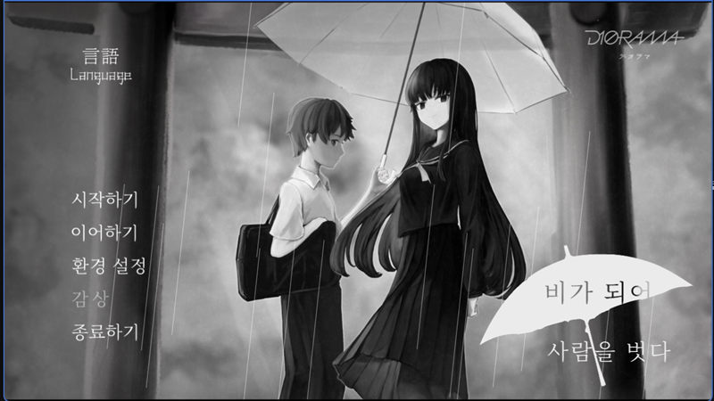

# 雨にして人を外れ / Absent in the Rain 한글 패치

일본어 원문을 기준으로 게임에 한국어(`한국어`) 언어를 추가하는 비공식 팬 패치입니다. 영어판과 중국어판은 원문이 중의적일 때 판단 근거로만 참고했습니다.

게임이 이미 지원하는 6개 언어 옆에 7번째 언어 슬롯을 새로 만드는 방식이라, 기존 언어의 동작에는 영향을 주지 않습니다.

## v1.0.1 적용 범위

**완료**

- 한국어 언어 슬롯(`sf.trans==7`) 신설: 엔진 5개 파일, 화면 템플릿 5개, 시나리오 3개 파일에 33곳 연결
- 타이틀 화면: 시작하기 / 이어하기 / 환경 설정 / 감상 / 종료하기
- 게임 내 메뉴 8종과 설명 패널 8종
- 환경 설정 화면 전체(항목명, 최소·최대 표기, 예/아니오)
- 저장·불러오기·기록 화면과 각 화면의 머리글
- 감상(갤러리) 화면: 장면 선택 14개, 음악 8곡 제목, 각 장면 줄거리
- 선택지 이미지 2종, 언어 선택 버튼, 보너스 개방 알림
- 우산 타이틀 로고 `비가 되어 / 사람을 벗다`
- 화자 이름표 1,132곳(하루야·선배·부장·우요·유키노)
- 본편과 분기, EX 시나리오의 서술·대사 1,841줄 전체 번역

## 지원 환경

- 플랫폼: Windows / Steam (AppID 2168610)
- 게임 버전: `data/system/Config.tjs` 기준 `game_version=1.04`
- 설치 폴더 기본값: `SteamLibrary\steamapps\common\amehazu`
- 대상 파일 70개 전부의 원본 SHA-256을 검사하며, 대표값으로 `resources\app\data\scenario\first.ks`는 다음과 같습니다.
  `2A2D08495D52C3D640025FFBD9143B16CD6CFA4001B4BF881586C0217C2156BA`

원본 해시가 하나라도 다르면 설치를 중단합니다.

## 설치 방법

1. [Releases](https://github.com/BK927/korean-game-patches/releases)에서 `AMEHAZU_KoreanPatch_v1.0.1.zip`을 받습니다.
2. 원하는 폴더에 압축을 완전히 풉니다.
3. 게임을 종료합니다.
4. `INSTALL_KOREAN_PATCH.bat`을 실행합니다.
5. 자동으로 게임을 찾지 못하면 `amehazu` 폴더 경로를 입력합니다.
6. 게임을 실행하고 타이틀 화면 왼쪽 위 `言語 / Language`에서 `한국어`를 선택합니다.

설치 프로그램은 덮어쓰는 원본 13개를 같은 폴더에 `*.korean-patch-backup`으로 먼저 보관한 뒤, 변경분을 적용하고 결과를 SHA-256으로 다시 검사합니다. 이미 설치되어 있으면 아무것도 바꾸지 않고 종료합니다.

처음 설치한 뒤 언어를 한 번도 고른 적이 없다면 한국어로 시작합니다. 이전에 다른 언어를 골랐다면 그 설정이 유지되므로 언어 메뉴에서 직접 바꾸면 됩니다.

## 원상 복구

패치 폴더의 `RESTORE_ORIGINAL.bat`을 실행합니다. 백업해 둔 원본 13개를 되돌리고 패치가 추가한 파일 57개를 지운 뒤, 복구된 파일의 SHA-256을 검사합니다. Steam의 파일 무결성 검사로도 복구할 수 있습니다.

## 알려진 제한

- OP·ED 영상은 자막이 영상 자체에 새겨져 있고 한국어 영상이 없어서 일본어판을 그대로 사용합니다.
- 게임 내 손글씨 낙서(칠판 사진)는 원작 미술을 보존하고 이름만 아래에 덧붙였습니다. 영어판과 같은 방식입니다.
- 저장 슬롯의 날짜 표기 등 엔진이 직접 그리는 일부 문자열은 원래 형식을 따릅니다.
- 게임이 업데이트되어 대상 파일이 바뀌면 새 버전 대응이 필요합니다.

## 배포 형식

게임 파일 전체 대신 약 4.2MB의 VCDIFF 변경분과 약 64KB의 자체 제작 이미지만 제공합니다. 대상 파일 70개 중 40개는 사용자가 보유한 정품 원본에서 재구성하며, 나머지 30개는 빈 캔버스에 직접 조판한 한글 이미지입니다. 원본 게임 파일은 저장소와 릴리스 어느 쪽에도 포함되지 않습니다.

한글 조판에는 게임에 이미 들어 있는 `NotoSerifCJK-Regular.ttc`의 Noto Serif CJK KR 페이스를 사용했으므로, 별도의 글꼴 파일을 추가하지 않습니다.

Xdelta 3.2.0은 Apache License 2.0으로 배포되며 자세한 고지는 배포본의 `THIRD_PARTY_NOTICES.md`에 있습니다.

## 권리 관계

정품 보유자를 위한 비공식 팬 패치이며, 개발사의 허락을 받아 제작한 것이 아닙니다. 게임과 상표, 시나리오를 포함한 모든 권리는 개발사 DIORAMA에 있습니다. 권리자의 요청이 있으면 관련 자료를 조정하거나 제거합니다.
