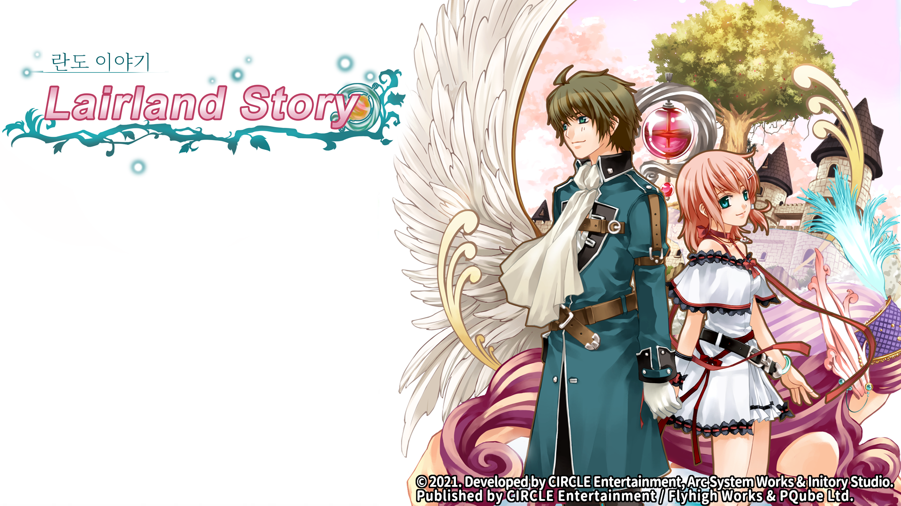
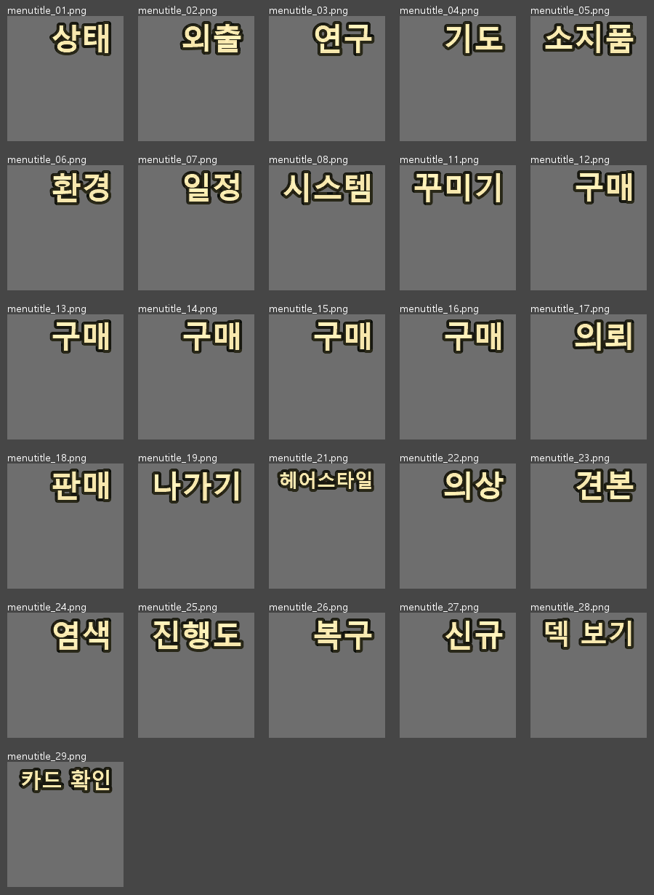

# Lair Land Story Remake Edition 한글 패치

Steam판 `Lair Land Story Remake Edition`의 비공식 한국어 패치입니다.

제작사의 번체중문판(`cnh`)을 기본 원문으로 번역했습니다. 일본어·영어판은 고유명사나 모호한 문장을 확인할 때만 참고했으며, 번체중문과 내용이 다른 경우에는 번체중문을 따랐습니다.





## v0.1.1-rc1 적용 범위

- 스토리·대사·선택지 고유 문구 14,965개
- 메뉴·아이템·상태·도움말 UI 문구 748개
- 게임 코드 내부 시스템 문구 610개
- 한국어 글꼴 적용
- 메뉴 이미지 26개, 제목 이미지 2개, 설정 이미지 13개 한국어화
- 인명·지명·왕도/왕궁·상태명 고정 용어 통합 검수

게임 구조상 한국어는 영문 언어 슬롯(언어 번호 3)에 적용됩니다. 번역의 기준은 영문이 아니라 번체중문 원문입니다.

## 지원 환경

- 플랫폼: Windows / Steam
- Steam AppID: `1268140`
- 지원 Steam BuildID: `9253648`
- 엔진: Unity `2018.4.20f1` Mono

설치기는 변경 대상 46개 파일의 SHA-256을 모두 확인합니다. 게임 업데이트로 원본 해시가 달라졌다면 강제로 적용하지 마세요.

## 설치

1. 게임을 종료합니다.
2. [GitHub Releases](https://github.com/BK927/korean-game-patches/releases/tag/lair-land-story%2Fv0.1.1-rc1)에서 `Lair-Land-Story-Remake-Korean-Patch-0.1.1-rc1.zip`을 받아 완전히 풉니다.
3. 압축을 푼 폴더에서 PowerShell을 열고 다음 명령을 실행합니다.

```powershell
powershell -NoProfile -ExecutionPolicy Bypass -File .\install.ps1 `
  -Force `
  -GameRoot "D:\SteamLibrary\steamapps\common\Lair Land Story Remake Edition"
```

설치 시 원본 파일은 게임 폴더의 `.korean-patch-backup\Lair-Land-Story-날짜-시간` 아래에 자동 백업됩니다. 설치가 중간에 실패하면 자동으로 원본을 복구합니다.

## 설치 확인

```powershell
powershell -NoProfile -ExecutionPolicy Bypass -File .\verify.ps1 `
  -GameRoot "D:\SteamLibrary\steamapps\common\Lair Land Story Remake Edition" `
  -State patched
```

## 원상 복구

백업이 하나뿐이라면 다음 명령으로 복구할 수 있습니다.

```powershell
powershell -NoProfile -ExecutionPolicy Bypass -File .\restore.ps1 `
  -Force `
  -GameRoot "D:\SteamLibrary\steamapps\common\Lair Land Story Remake Edition"
```

백업이 여러 개라면 설치 완료 메시지에 표시된 폴더를 `-BackupRoot`로 지정하세요.

## 검증 상태와 제한

- 번역 16,323개 단위의 빈 문자열, 태그·줄바꿈, 잔여 중국어·일본어, 인명·핵심 용어 검사를 통과했습니다.
- 수정된 DLL에서 영문 메시지 클래스 참조가 0개이고 한국어가 들어간 번체중문 메시지 클래스 참조가 정상 연결되는 것을 확인했습니다.
- 수정된 Unity 자산 42개를 다시 읽어 구조 오류가 없음을 확인했습니다.
- 포함된 모든 xdelta는 원본에서 복원한 결과가 최종 파일 SHA-256과 일치하는지 왕복 검증했습니다.
- 메뉴·제목·설정 이미지는 추출본으로 글자 깨짐과 잘림이 없는 것을 확인했습니다.
- 실제 게임에서 한국어 대사와 설정 화면 제목·8개 항목이 정상 표시되는 것을 확인했습니다.
- 글꼴 내부 패밀리명과 Unity 직렬화 이름을 일치시켜 빈 글자 현상을 수정했습니다.
- 스토리 TSV의 물리 행 수와 열 수를 원본과 대조해 진행 중단을 일으키는 줄바꿈 오류를 수정했습니다.
- 모든 분기를 엔딩까지 플레이하는 전 경로 검증은 아직 완료되지 않았으므로 현재 버전은 릴리스 후보입니다.

## 배포 형식

게임 원본 파일은 포함하지 않습니다. 정품 게임 파일에 적용하는 xdelta 변경분, 설치·검증·복구 도구만 제공합니다.

한국어 글꼴은 Noto Sans CJK KR 및 Noto Serif KR을 사용했습니다. 글꼴 라이선스는 `OFL-NotoFonts.txt`, xdelta 관련 고지는 `tools` 폴더를 참고하세요.

## 권리 관계

정품 보유자를 위한 비공식 비영리 팬 패치이며 개발사·배급사·Steam의 공식 지원물이 아닙니다. 게임과 상표, 시나리오를 포함한 모든 권리는 각 권리자에게 있습니다.
